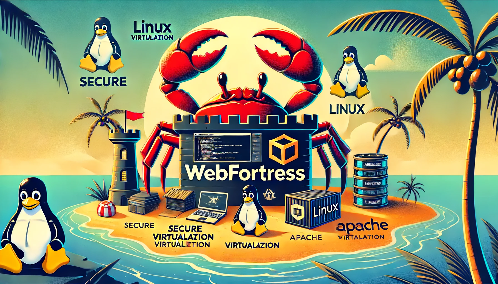

# WebFortress 🦀



WebFortress is an educational project aimed at creating a straightforward container-based system leveraging Rust's performance and safety features. This project serves as a practical exploration into the fundamentals of containerization and virtualization technologies, simulating a minimalistic version of Docker-like functionality. By developing a basic container system, contributors and learners can gain hands-on experience with the underlying mechanisms that enable containerization, such as namespaces and cgroups, all within the context of Rust's ecosystem. This initiative not only fosters a deeper understanding of operating system concepts but also showcases the versatility of Rust in system-level programming tasks.

## Project Members

- Luis David Garcia ([lgarc120@calpoly.edu](mailto:lgarc120@calpoly.edu))
- Paul Jarski ([pjarski@calpoly.edu](mailto:pjarski@calpoly.edu))

## Getting Started

These instructions will get you a copy of the project up and running on your local machine for development and testing purposes.

### Prerequisites

- Git
- Rust and Cargo
- Python 3 and pip3

The provided setup script will guide you through installing Rust, Cargo, and necessary Python packages if they are not already installed on your system.

### Setup

**NOTE:** Development must occur in a Linux environment to make full use of the container, otherwise the program will fail, as it was not developed for any other operating system yet.

To set up your local development environment, follow these steps:

1. **Clone the repository**

   ```sh
   git clone git@github.com:luisdavidgarcia/WebFortress.git
   cd WebFortress
   ```

2. **Make the setup script executable**

    ```sh
    chmod +x setup.sh
    ```

3. **Run the setup script**

    ```sh
    ./setup.sh
    ```

This script will install any missing prerequisites (such as Rust and Cargo), set up pre-commit hooks for code quality, and prepare your development environment.

## Developing

After running the setup, you can start developing immediately. The repository is structured as follows:

- `src/`: Source files for your Rust projects.
- `scripts/`: Utility scripts that might be helpful during development.
- `examples/`: Examples of how the containers are deployed.

## Contributing

We welcome contributions to this project! Please consider the following steps:

- Create your feature branch (`git checkout -b feature/AmazingFeature`).
- Commit your changes (`git commit -m 'Add some AmazingFeature'`).
- Push to the branch (`git push origin feature/AmazingFeature`).
- Open a pull request.

## License

This project is licensed under the GNU License - see the [LICENSE](./LICENSE) file for details.

## Acknowledgements

We would like to thank Litchi Pi for his great [tutorial on creating a container in Rust](https://litchipi.github.io/), which ultimately helped build the foundation for this project.
